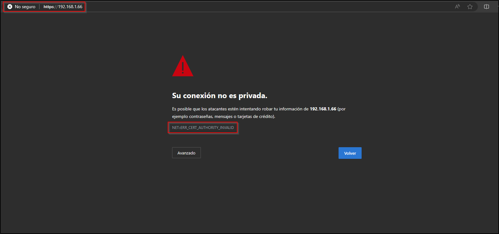

# Proyecto 9 - parte 2

En la máquina virtual usada en la parte 1, instala un servidor web y prepáralo para servir una página de prueba. Genera un certificado autofirmado y configura HTTPS. Obtén una captura del error que proporciona el navegador y otra de los datos de tu certificado en el mismo.

Una vez instalado nuestro servicio Apache2, lo hemos configurado para utilizar HTTPS con un certificado autofirmado, una vez completada toda la configuración, tendremos el siguiente resultado:

Si examinamos nuestro certificado obtendremos lo siguiente:

Este es un certificado legítimo de un sitio web, en este caso hemos elegido el sitio web de www.twitch.tv.

Ahora vamos a realizar una comparación de ambos certificados, detallando los datos más significativos de ambos:

**Emisor y Sujeto:**

- **Autofirmado:** Emitido por y para “MiCasita” bajo la organización “IESMiCasa”.
- **Legítimo:** Emitido por “GlobalSign Atlas R3 DV TLS CA 2023 Q3” para “twitch.tv”.

**Período de Validez:**

- **Autofirmado:** Válido desde el 16 de abril de 2024 hasta el 16 de abril de 2025.
- **Legítimo:** Válido desde el 1 de septiembre de 2023 hasta el 2 de octubre de 2024.

**Extensiones:**

- **Autofirmado:** No incluye extensiones críticas requeridas para ciertos usos.
- **Legítimo:** Incluye extensiones como el nombre alternativo del sujeto y el uso de la clave, que son importantes para la seguridad y la funcionalidad.

**Diferencias Clave:**

- **Autenticidad:** El certificado legítimo es emitido por una autoridad de certificación reconocida, mientras que el autofirmado no tiene una entidad externa que respalde su autenticidad.
- **Confianza:** Los navegadores y clientes confían en certificados de autoridades reconocidas sin advertencias adicionales, a diferencia de los certificados autofirmados que suelen generar alertas de seguridad.
