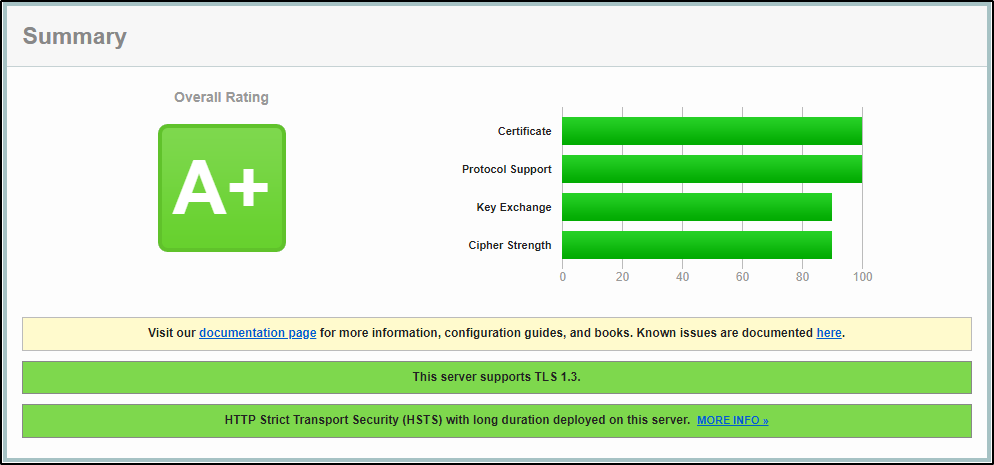

# Proyecto 9 - parte 3

## Certificado válido de Twitch.tv.

**Calificación**: Tenemos resumen de la calificación del certificado SSL, indicando una calificación de A+ teniendo la barra llena en los campos: certificado y protocolo de soporte, el intercambio de claves y fuerza del cifrado también están casi llenas, alrededor de un 90%.

Esto es muy relevante ya que señala un alto nivel de seguridad web.

Estas barras tienen el siguiente significado: 

- **Calificación A+**: Indica que el certificado SSL ha pasado todas las pruebas críticas de seguridad y rendimiento.
- **Soporte de Protocolo**: Muestra que el servidor soporta versiones seguras y actualizadas de protocolos TLS.
- **Intercambio de Claves**: Refleja que el servidor utiliza métodos de intercambio de claves robustos y seguros.
- **Fuerza del Cifrado**: Indica que el servidor emplea algoritmos de cifrado fuertes para proteger la información.

**Detalles del Certificado SSL**: En la sección de detalles del certificado, podemos comprobar su validez pudiendo observar que sigue vigente. También podemos encontrar los siguientes datos:

- **Información del titular**: Esto incluye el nombre de la organización que posee el certificado y, a veces, su ubicación geográfica.
- **Información del emisor**: Esto incluye el nombre de la Autoridad de Certificación (CA) que emitió el certificado SSL.
- **Detalles del algoritmo de firma**: Esto muestra qué algoritmo se utilizó para firmar el certificado.
- **Clave pública**: Esto muestra la clave pública del titular del certificado.
- **Uso previsto**: Esto muestra para qué se puede utilizar el certificado, como por ejemplo, para asegurar la comunicación entre el servidor y el cliente.

Toda esta información nos dan los motivos que llevan a verificar este certificado como válido.

Tres certificados erróneos de diferente tipo Analízalos también usando un servicio y explica los motivos que llevan a verificarlos como no válidos.

## Análisis de tres certificados erróneos de distinto tipo.

### Primer certificado
[https://edellroot.badssl.com](https://edellroot.badssl.com/)

Podemos comprobar las siguientes razones por las cuales este certificado es erróneo:

- **Fecha Inválida:** El certificado ha **expirado** y ya no es válido.
- **Clave de servidor**: La clave del servidor puede ser **insegura** o **comprometida**.
- **Confianza**: El certificado no es **confiable** porque no está emitido por una **Autoridad de Certificación reconocida**.

### Segundo certificado
[https://expired.badssl.com](https://expired.badssl.com/)

Podemos comprobar las siguientes razones por las cuales este certificado es erróneo:

- **Fecha Inválida**: El error net::ERR_CERT_DATE_INVALID nos indica que la fecha del certificado SSL ha expirado.
- **Conexión Insegura**: La advertencia “Su conexión no es privada” sugiere que la información enviada o recibida a través de esta página no está segura.
- **Riesgo de Ataque**: Existe el riesgo de que los atacantes puedan intentar robar información sensible como contraseñas o tarjetas de crédito.
- **Certificado Autofirmado**: Los certificados autofirmados no son emitidos por una autoridad de certificación y generalmente no son confiables para los navegadores.

### Tercer certificado

[https://dh-composite.badssl.com](https://dh-composite.badssl.com/)

Podemos comprobar las siguientes razones por las cuales este certificado es erróneo:

- **Conjunto de Cifrados (Cipher Suites)**: Si el certificado utiliza conjuntos de cifrados obsoletos o inseguros, esto puede ser una señal de debilidad en la seguridad.
- **Protocolos TLS**: El uso de versiones antiguas de protocolos TLS, como TLS 1.0 o TLS 1.1, puede resultar en una calificación de seguridad más baja.
- **Configuración del Servidor**: Una configuración incorrecta del servidor que aloja el certificado puede llevar a vulnerabilidades de seguridad.
- **Compatibilidad con Navegadores**: Los certificados deben ser compatibles con los navegadores modernos para garantizar una conexión segura.
